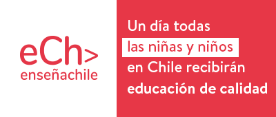

<h1 align="center">Hola 👋, Un gusto! Soy Bayron Loaiza ^^ </h1>
<h3 align="center">Joven Desarrollador y Profesor de Enseñanza Media </h3>

📫 Te puedes comunicar conmigo en:
- 📫 **bayron_fabian@hotmail.com**
- 📫 **Rapzotheru@gmail.com**

<h3 align="left">También puedes encontrarme en:</h3>

   <!-- Facebook -->
   <!-- Instagram -->                              
   <!-- Twitter -->
   <!-- Linkedin -->
<!--   <!-- Tumblr -->

<h3 align="left">Trabajo y he trabajado con:</h3>

   <!-- Elixir -->
  <!-- Phoenix --> 
  <!-- React --> 
  <!-- Javascript --> 
  <!-- Java --> 
  <!-- Bootstrap--> 
  <!-- html --> 
  <!-- CSS --> 
  <!-- Jquery --> 
  <!-- Python --> 
  <!-- Django --> 
  <!-- Git --> 
   <!-- Nginx --> 
   <!-- PHP --> 
   <!-- Ruby--> 
   <!-- Rails --> 
   <!-- Redhat --> 
   <!-- PostgreSQL --> 
   <!-- Jupyter --> 
   <!-- Linux --> 
   <!-- MySQL --> 
   <!-- mariadb --> 
   <!-- mongoDB --> 
   <!-- Debian --> 
   <!-- Fedora --> 
   <!-- freshdesk --> 
   <!-- POSTMAN --> 
   <!-- Visualstudio --> 
   <!-- UBUNTU --> 
   <!-- UNITY --> 
   <!-- UNREAL --> 
   <!-- C SHARP --> 
   <!-- C ++ --> 
   <!-- SQL Server --> 

<h2 align="Center">Si eres profesional y te sientes llamado por hacer un cambio en la educación y disminuir la brecha, unete a la red de Enseña Chile</h2>
<h3 align="Center">Para que todos los jovenes de Chile reciban educación de calidad</h3>

   <!-- Enseña Chile --> 

<h1 align="Center">Muchas gracias por visitarme, que estés muy bien</h1>

<!--
**fvrby/Fvrby** is a ✨ _special_ ✨ repository because its `README.md` (this file) appears on your GitHub profile.

Here are some ideas to get you started:

- 🔭 I’m currently working on ...
- 🌱 I’m currently learning ...
- 👯 I’m looking to collaborate on ...
- 🤔 I’m looking for help with ...
- 💬 Ask me about ...
- 📫 How to reach me: ...
- 😄 Pronouns: ...
- ⚡ Fun fact: ...
-->
  
